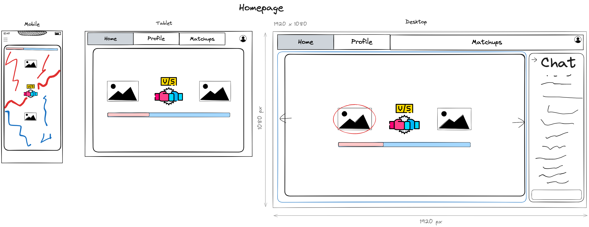

# versus
cool app to vote on which character is better


# Versus
[](https://github.com/MrTofuuu/versus/issues?q=is%3Aopen)
[](https://github.com/MrTofuuu/versus/issues?q=is%3Aclosed)
[](https://github.com/MrTofuuu/versus/pulls?q=is%3Apr+is%3Aclosed)
[](https://github.com/MrTofuuu/versus/stargazers)
[](./LICENSE)


## Description
A fun app to vote on your character bias


ljasdlfjlskdjf

## Table of Contents
- [Important URLs](#urls)
- [Contributors](#contributors)
- [Usage](#usage)
- [User Story](#user-story)
- [Acceptance Criteria](#acceptance-criteria)
- [Mockup](#mock-up)
- [Packages](#packages)
- [Libraries](#libraries)
- [License](#Licensing)

## Installation

This application leverages `PNPM` as the node package manager. To learn more about how to install `PNPM`, refer to documentation [here](https://pnpm.io/installation) 

To install the application, you must run `pnpm install` in the root directory and then you can run `pnpm run install` to install client and server packages from root directory

## URLs

## Contributors
- [Chris Stallcup](https://github.com/MrTofuuu/)


## Usage


## User-Story
```md
coming soon
```

## Mock-Up


## Packages


## Libraries


## Licensing
The project is made possible with the following licensing:
- [MIT](license)